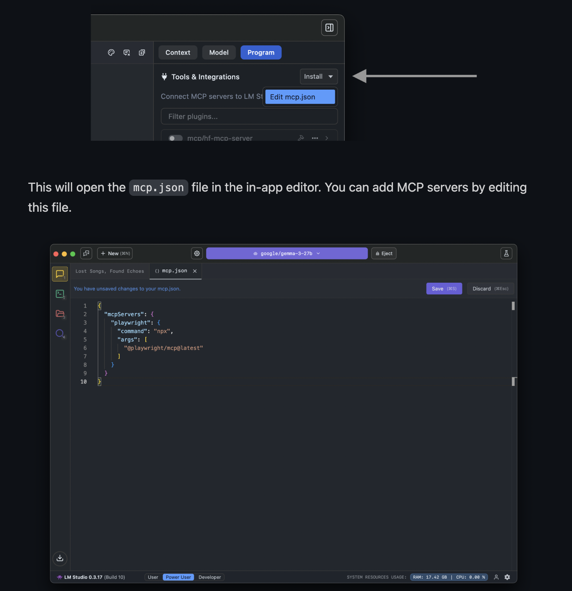

# CoexistAI v0.0.2 

<p align="center">
  
</p>

## 🚀 What's New in v2: [Example Usage patterns](demo_queries.ipynb)

- **Direct location search:** You can now search for any place, not just find routes!
- **Advanced Reddit search:** Use your own phrases to search across reddit; results ranked better with BM25 for sharper discovery.
- **YouTube power-up:** Search and summarize YouTube using your own search phrases or video URLs and even add a prompt for custom responses.
- **Explore to your folders/files**: Explore local folders and files with extended support to diverse files including (vision integrated)'.png', '.jpg', '.jpeg', '.gif', '.bmp', '.webp', '.tiff', '.svg', etc, more to come..
- **Sharper web search:** More focused and actionable results than ever before.
- **MCP support everywhere:** Now fully connect coexistai to LM Studio and other MCP hosts—seamless integration! [See Guide](README_MCP.md)
- **GitHub & local repo explorer:** Explore ask questions about codebases - works with both GitHub and local repos!

---

## 🛠 Quick Start

### Method (Less flexible but faster):

1. **Clone the repository:**
   ```sh
   git clone https://github.com/SPThole/CoexistAI.git coexistai
   cd coexistai
   ```


2. **Configure your model and embedding settings:**
   
   - Edit `model_config.py` to set your preferred LLM and embedding model.
   - Add LLM and Embedder API Key (for google mode both would be same)
   - Example (for full local mode):
    ```py
    model_config = {
      # Name of the LLM model to use. For local models, use the model name served by your local server.
      "llm_model_name": "google/gemma-3-12b",

      # LLM provider type: choose from 'google', 'local', 'groq', or 'openai' or 'others' 
      # in case of 'others' (base url needs to be updated in openai_compatible given below accordingly).
      # Make sure to update the api_key variable above to match the provider.
      "llm_type": "local",

      # List of tools or plugins to use with the LLM, if any. Set to None if not used.
      "llm_tools": None,

      # Additional keyword arguments for LLM initialization.
      "llm_kwargs": {
        "temperature": 0.1,  # Sampling temperature for generation.
        "max_tokens": None,  # Maximum number of tokens to generate (None for default).
        "timeout": None,     # Timeout for API requests (None for default).
        "max_retries": 2,    # Maximum number of retries for failed requests.
        "api_key": llm_api_key,  # API key for authentication.
      },

      # Name of the embedding model to use.
      # For Google, use their embedding model names. For local/HuggingFace, use the model path or name.
      "embedding_model_name": "nomic-ai/nomic-embed-text-v1",

      "embed_kwargs":{}, #additional kwargs for embedding model initialization

      # Embedding backend: 'google' for Google, 'infinity_emb' for local/HuggingFace models.
      "embed_mode": "infinity_emb",

      # Name of the cross-encoder model for reranking, typically a HuggingFace model.
      "cross_encoder_name": "BAAI/bge-reranker-base"
    }
    ```
   - See the file for all available options and defaults.

3. **Run the setup script:**
   - For macOS or Linux with zsh:
     ```sh
     zsh quick_setup.sh
     ```
   - For Linux with bash:
     ```sh
     bash quick_setup.sh
     ```

   > The script will:
   > - Pull the SearxNG Docker image
   > - Create and activate a Python virtual environment
   > - **USER ACTION NEEDED** Set your `GOOGLE_API_KEY` (edit the script to use your real key). [Obtain your API key (Currently Gemini, OpenAI and ollama is supported)](https://ai.google.dev/gemini-api/docs/api-key) from your preferred LLM provider. (Only needed when google mode is set, else set in model_config.py)
   > - Start the SearxNG Docker container
   > - Install Python dependencies
   > - Start the FastAPI server

4. **That’s it!**  
   The FastAPI and MCP server will start automatically and you’re ready to go.

**Note:**  
- Make sure Docker, Python 3, and pip are installed on your system.  
- Edit quick_setup.sh to set your real `GOOGLE_API_KEY` before running (needed if using google models) 
- Windows users can use [WSL](https://docs.microsoft.com/en-us/windows/wsl/) or Git Bash to run the script, or follow manual setup steps.

## 🔍 What Can You Do? (API Highlights & Examples)

**Remove comments after // before pasting**
Swagger UI: http://127.0.0.1:8000/docs  if you haven't changed the host and port

### 1. Web Search
**Search the web, summarize, and get actionable answers—automatically.**

**Endpoint:**  
POST `/web-search`

**Request Example:**
```json
{
  "query": "Top news of today worldwide", // Query you want to ask; if you provide a URL and ask to summarise, it will summarize the full page.
  "rerank": true, // Set to true for better result ranking.
  "num_results": 2, // Number of top results per subquery to explore (higher values = more tokens, slower/more costly).
  "local_mode": false, // Set to true to explore local documents (currently, only PDF supported).
  "split": true, // Set to false if you want full pages as input to LLMs; false may cause slower/more costly response.
  "document_paths": [] // If local_mode is true, add a list of lists of document paths, e.g., [["documents/1706.03762v7.pdf"]]
}

```

or QA/sumamrise local documents 

```json
{
  "query": "Summarise this research paper",
  "rerank": true,
  "num_results": 3,
  "local_mode": true,
  "split": true,
  "document_paths": [["documents/1706.03762v7.pdf"]] // Must be a list of lists.
}
```

---

### 2. Summarize Any Web Page
**Summarize any article or research paper by URL.**

**Endpoint:**  
POST `/web-summarize`

**Request Example:**
```json

{
  "query": "Write a short blog on the model", // Instruction or question for the fetched page content.
  "url": "https://huggingface.co/unsloth/Qwen3-8B-GGUF", // Webpage to fetch content from.
  "local_mode": false // Set to true if summarizing a local document.
}

```

---

### 3. YouTube Search 
**Search YouTube (supports prompts and batch).**

**Endpoint:**  
POST `/youtube-search`

**Request Example:**
```json

{
  "query": "switzerland itinerary", // Query to search on YouTube; if a URL is provided, it fetches content from that URL. url should be in format: https://www.youtube.com/watch?v=videoID
  "prompt": "I want to plan my Switzerland trip", // Instruction or question for using the fetched content.
  "n": 2 // Number of top search results to summarize (only works if query is not a URL).
}
```

---

### 4. Reddit Deep Dive
**Custom Reddit search, sort, filter, and get top comments.**

**Endpoint:**  
POST `/reddit-search`

**Request Example:**
```json

{
  "subreddit": "", // Subreddit to fetch content from (use if url_type is not 'search').
  "url_type": "search", // 'search' for phrase search; "url" for url, otherwise, use 'hot', 'top', 'best', etc.
  "n": 3, // Number of posts to fetch.
  "k": 1, // Number of top comments per post.
  "custom_url": "", // Use if you already have a specific Reddit URL.
  "time_filter": "all", // Time range: 'all', 'today', 'week', 'month', 'year'.
  "search_query": "gemma 3n reviews", // Search phrase (useful if url_type is 'search').
  "sort_type": "relevance" // 'top', 'hot', 'new', 'relevance' — controls how results are sorted.
}

```

---

### 5. Map & Location/Route Search
**Find places, routes, and nearby points of interest.**

**Endpoint:**  
POST `/map-search`

**Request Example:**
```json

{
  "start_location": "MG Road, Bangalore", // Starting point.
  "end_location": "Lalbagh, Bangalore", // Destination.
  "pois_radius": 500, // Search radius in meters for amenities.
  "amenities": "restaurant|cafe|bar|hotel", // Amenities to search near start or end location.
  "limit": 3, // Maximum number of results if address not found exactly.
  "task": "route_and_pois" // Use 'location_only' for address/coordinates only, or 'route_and_pois' for routes and POIs.
}
```

OR search for any single location (open street map has api rate limit)

```json

{
  "start_location": "MG Road, Bangalore",
  "end_location": "Lalbagh, Bangalore",
  "pois_radius": 500,
  "amenities": "restaurant|cafe|bar|hotel",
  "limit": 3,
  "task": "location_only"
}

```

---

### 6. GitHub & Local Repo Directory Tree
**Get the directory structure of any GitHub or local repo.**

**Endpoint:**  
POST `/git-tree-search`

**Request Example:**
```json

{
  "repobaseurl": "https://github.com/SPThole/CoexistAI/" // Base URL of the repository to explore.
}
```
or for local repo:
```json

{
"repobaseurl": "/home/user/projects/myrepo"
}

```

---

## 🧑‍💻 Integrate coexistai as an MCP Server (LM Studio, Cursor, etc.)

Starting LM Studio 0.3.17, LM Studio acts as an Model Context Protocol (MCP) Host. This means you can connect MCP servers to the app and make them available to your models. 


You can now run coexistai as an MCP server—**plug it into LM Studio** or any other MCP-compatible tool!

### How to Integrate with LM Studio

1. Download lm studio> 0.3.17 (https://lmstudio.ai/docs/app)

2. Find the [MCP guide](https://lmstudio.ai/docs/app/plugins/mcp)

<p align="center">
  
</p>

1. **Edit your `mcp.json` in LM Studio:**
    - Go to the Program tab → `Install > Edit mcp.json`
    - Add coexistai as a server. Example:
    ```json
    {
        "mcpServers": {
             "coexistai": {
                "url": "http://127.0.0.1:8000/mcp"
        }
    }
    }
    ```
    - Replace with your actual server address and token (if needed).

2. **Or use an "Add to LM Studio" button** (if provided on coexistai website).

**Security note:** Only use MCP servers you trust—servers can access files/network.

3. Use [system prompt](system_prompt.py) as context (system prompt) in lmstudio
---

## 🏆 Best Local Model

For fastest, highest-quality local LLM results, I have personally liked following:  
**unsloth/Qwen3-8B-GGUF**

---